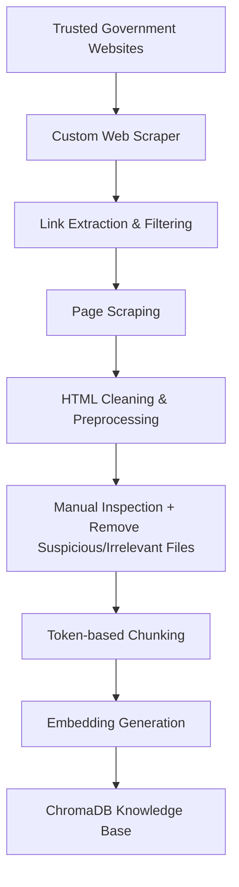
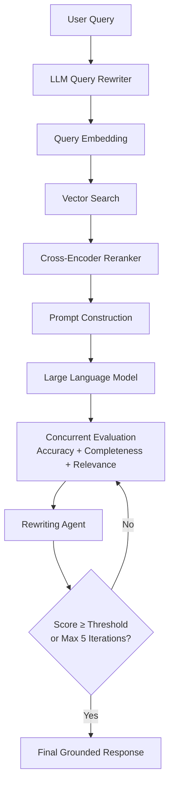

#  Disaster Management RAG Assistant

**An end-to-end Retrieval-Augmented Generation (RAG) system built entirely from scratch using open-source models to deliver reliable, context-grounded disaster preparedness and emergency management information.**


---

# 🎥 Demo


**▶ [Watch Demo Video](assets/demo.mp4)

---

#  Why This Project?

During disasters, access to **accurate and trustworthy information** is critical. While Large Language Models are powerful, they may generate hallucinated or outdated responses. This project addresses that limitation by:

1. Grounding every response in information retrieved from trusted government resources.
2. Running a multi-agent coaching loop that evaluates and refines the answer for accuracy, completeness, and clarity before delivering it to the user.

---

#  Highlights

-  Built an end-to-end Retrieval-Augmented Generation (RAG) pipeline completely from scratch
-  Custom web scraping pipeline for trusted government disaster management resources
-  Semantic retrieval with Cross-Encoder reranking
-  Interactive Gradio chat interface with conversation memory
-  Comprehensive evaluation using retrieval metrics and LLM-as-Judge
-  Multi-agent orchestration (OpenAI SDK) that acts as a coach — 4 specialized agents work in a loop to produce the highest-quality answer
-  RAG core built entirely with open-source models and tools

---

#  Features

-  Custom web scraping pipeline from official government websites
-  Knowledge base built exclusively from trusted sources (with manual quality review)
-  Intelligent token-based chunking with overlap
-  Semantic dense retrieval using Sentence Transformers
-  Query rewriting using an open-source LLM to improve retrieval quality
-  Cross-Encoder reranking for higher retrieval precision
-  Gradio chat interface with conversation history
-  **Multi-agent coaching loop** powered by OpenAI SDK  
  (Accuracy, Completeness & Relevance agents run concurrently → Rewriting Agent → loops up to 5 times or until quality threshold)
-  Extensive evaluation using retrieval and generation metrics
-  Fully open-source RAG core + OpenAI SDK for agent orchestration

---

#  System Architecture

## Knowledge Base Creation Pipeline



---

## Retrieval & Generation Pipeline



---

## Multi-Agent Coaching Loop

The system uses a multi-agent coaching loop orchestrated with the **OpenAI SDK** to iteratively refine every response.

**How it works:**

1. Three evaluation agents run **concurrently**:
   - **Accuracy Agent** – checks factual correctness against retrieved sources
   - **Completeness Agent** – checks whether all relevant aspects of the query are covered
   - **Relevance Agent** – evaluates how relevant the answer is to the user’s question

2. The feedback from these three agents is passed to the **Rewriting Agent**, which improves the answer.

3. This process repeats in a loop (maximum **5 iterations**) or until the **weighted average score** of the three evaluation agents reaches a predefined quality threshold.

This closed-loop design acts as an automated coach, continuously improving the answer until it meets high standards of accuracy, completeness, and relevance.

---

#  Screenshots

## User Interface


---

## Retrieval Pipeline


---

## Evaluation Results

### Retrieval Metrics


### LLM-as-Judge Metrics


---

#  Technology Stack

| Component               | Technology                          |
|-------------------------|-------------------------------------|
| **User Interface**      | Gradio                              |
| **LLM (RAG Core)**      | Ollama                              |
| **Vector Database**     | ChromaDB                            |
| **Embedding Model**     | Sentence Transformers               |
| **Reranker**            | CrossEncoder                        |
| **Web Scraping**        | Requests, BeautifulSoup, Selenium   |
| **Chunking**            | Chonkie                             |
| **Agent Orchestration** | OpenAI SDK                          |
| **Evaluation**          | Custom Benchmark + LLM-as-Judge     |

---

#  Knowledge Base

The knowledge base is constructed entirely from trusted government disaster management resources using a custom scraping and preprocessing pipeline.

The pipeline includes:

- Web scraping from official government websites
- HTML cleaning and preprocessing
- Token-based chunking with overlap
- Dense embedding generation
- Storage in ChromaDB for semantic retrieval


> **Note:** After building the knowledge base, I manually reviewed the scraped content and removed suspicious or low-value files that were not useful for disaster management. This additional quality check helped ensure the knowledge base remained clean, relevant, and trustworthy.

---

#  Evaluation

The system was evaluated on a custom benchmark consisting of **150 disaster management questions** spanning multiple emergency scenarios.

The evaluation focused on:

- Retrieval quality
- Response accuracy
- Context relevance
- Response completeness
- Keyword coverage

### Evaluation Design

Two separate test sets were used to evaluate different parts of the system:

- **Retrieval Evaluation**: Questions were carefully derived from the knowledge base content to measure how well the system retrieves relevant documents (benchmark_tests.jsonl).
- **Answer Evaluation (LLM-as-Judge)**: More natural, general user-style queries were used to evaluate the quality of the final generated answers, reflecting how real users would typically ask questions (standard_tests.jsonl).

## Retrieval Metrics

| Metric | Score |
|---------|-------|
| **MRR (Mean Reciprocal Rank)** | **0.8192** |
| **NDCG (Normalized Discounted Cumulative Gain)** | **0.8267** |
| **Keyword Coverage** | **86.0%** |

## LLM-as-Judge Metrics

| Metric | Score |
|---------|-------|
| **Answer Accuracy** | **4.24/ 5** |
| **Response Completeness** | **4.17 / 5** |
| **Context Relevance** | **4.96 / 5** |

> Detailed evaluation screenshots are included in the repository.

---

#  Example Query

### User

```text
What do I do before a disaster?
```

### Assistant

```text
**Before a Disaster:**

1. **Know your zone**: Understand if you live in a hurricane evacuation area by contacting your local government/emergency management office or checking the evacuation site website.
2. **Put Together an Emergency Kit**: Assemble a basic emergency kit with essential items, such as flashlights, generators, and storm shutters.
3. **Write or Review Your Family Emergency Plan**: Decide how you will get in contact with each other, where you will go, and what you will do in case of an emergency.
4. **Review Your Insurance Policies**: Ensure you have adequate coverage for your home and personal property.

**Additional Considerations:**

* Make sure your cell phone and portable radios are charged in case of a power outage or evacuation.
* Pack essential items, including food, water, and medications, in advance.
* If you live in an area prone to flooding, consider purchasing flood insurance and evacuate early if ordered to do so.

This guidance is based on official disaster management resources retrieved from the knowledge base.
```

---

#  Repository Structure

```text
Disaster-Management-RAG/
│
├── assets/                            # Screenshots and demo 
├── scraper/                           # Custom web scraping pipeline
├── knowledge_base/                    # Processed documents
├── implemenation/ingest.py            # Data Ingestion
├── vector_db/                         # ChromaDB persistence
├── agents_coach/                      # Agent orchestration
├── evaluation/                        # Gradio Benchmark (the interface) 
├── app.py                             # Gradio evaluation results
├── theme.py                           # gradio app (the interface)
├── requirements.txt
├── README.md
└── LICENSE     
```

---

#  Installation

Clone the repository:

```bash
git clone https://github.com/lavanya117/Disaster-Management-RAG.git

cd Disaster-Management-RAG
```

Install the required packages:

```bash
pip install -r requirements.txt
```

---

#  Build the Knowledge Base

```bash
python scraper\scraper.py
```

---

#  Generate Embeddings

```bash
python implementation\ingest.py
```

---


#  Launch the Application

```bash
python theme.py
```

The Gradio interface will launch in your browser, allowing you to interact with the Disaster Management RAG Assistant.

---

#  Future Improvements

- Hybrid retrieval (BM25 + Dense Retrieval)
- Metadata-aware retrieval and filtering
- Automated knowledge base updates
- Fine-tuned domain-specific language model
- Multimodal document ingestion
- Voice-enabled emergency assistant
- Expand multi-agent capabilities (e.g., source citation agent, safety-check agent)

---

#  License

This project is licensed under the **MIT License**.

---
