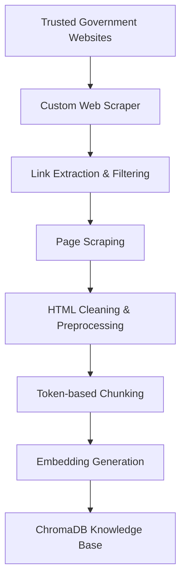

# 🌍 Disaster Management RAG Assistant

**An end-to-end Retrieval-Augmented Generation (RAG) system built entirely from scratch using open-source models to deliver reliable, context-grounded disaster preparedness and emergency management information.**


---

# 🎥 Demo


**▶ [Watch Demo Video](assets/demo.mp4)

---

# 📌 Why This Project?

During disasters, access to **accurate and trustworthy information** is critical. While Large Language Models are powerful, they may generate hallucinated or outdated responses. This project addresses that limitation by grounding every response in information retrieved from trusted government resources before generating an answer.

---

# ✨ Highlights

- ✅ Built an end-to-end Retrieval-Augmented Generation (RAG) pipeline completely from scratch
- ✅ Custom web scraping pipeline for trusted government disaster management resources
- ✅ Semantic retrieval with Cross-Encoder reranking
- ✅ Interactive Gradio chat interface with conversation memory
- ✅ Comprehensive evaluation using retrieval metrics and LLM-as-Judge
- ✅ Built entirely using open-source models and tools

---

# ✨ Features

- 🌐 Custom web scraping pipeline from official government websites
- 📚 Knowledge base built exclusively from trusted sources
- 📄 Intelligent token-based chunking with overlap
- 🧠 Semantic dense retrieval using Sentence Transformers
- ✍️ Query rewriting using an open-source LLM to improve retrieval quality
- 📈 Cross-Encoder reranking for higher retrieval precision
- 💬 Gradio chat interface with conversation history
- 📊 Extensive evaluation using retrieval and generation metrics
- ⚙️ Fully open-source implementation

---

# 🏗️ System Architecture

## Knowledge Base Creation Pipeline



---

## Retrieval & Generation Pipeline


---

# 🖼️ Screenshots

## User Interface


---

## Retrieval Pipeline


---

## Evaluation Results

### Retrieval Metrics


### LLM-as-Judge Metrics


---

# 🛠️ Technology Stack

| Component | Technology |
|-----------|------------|
| **User Interface** | Gradio |
| **LLM** | Ollama |
| **Vector Database** | ChromaDB |
| **Embedding Model** | Sentence Transformers |
| **Reranker** | CrossEncoder |
| **Web Scraping** | Requests, BeautifulSoup, Selenium |
| **Chunking** | Chonkie |
| **Evaluation** | Custom Benchmark + LLM-as-Judge |

---

# 📚 Knowledge Base

The knowledge base is constructed entirely from trusted government disaster management resources using a custom scraping and preprocessing pipeline.

The pipeline includes:

- Web scraping from official government websites
- HTML cleaning and preprocessing
- Token-based chunking with overlap
- Dense embedding generation
- Storage in ChromaDB for semantic retrieval


---

## 📈 Embedding Space Visualization

To qualitatively evaluate the semantic structure of the knowledge base, the generated document embeddings were projected into a two-dimensional space using **t-SNE** and visualized with **Plotly**.

The visualization demonstrates how semantically related disaster management documents cluster together, providing insight into the quality of the embedding model.


---

# 📊 Evaluation

The system was evaluated on a custom benchmark consisting of **150 disaster management questions** spanning multiple emergency scenarios.

The evaluation focused on:

- Retrieval quality
- Response accuracy
- Context relevance
- Response completeness
- Keyword coverage

## Retrieval Metrics

| Metric | Score |
|---------|-------|
| **MRR (Mean Reciprocal Rank)** | **0.7583** |
| **NDCG (Normalized Discounted Cumulative Gain)** | **0.7717** |
| **Keyword Coverage** | **87.1%** |

## LLM-as-Judge Metrics

| Metric | Score |
|---------|-------|
| **Answer Accuracy** | **3.90 / 5** |
| **Response Completeness** | **3.68 / 5** |
| **Context Relevance** | **4.62 / 5** |

> Detailed evaluation screenshots are included in the repository.

---

# 💬 Example Query

### User

```text
What should I do during an earthquake?
```

### Assistant

```text
If you are indoors during an earthquake:

• Drop to your hands and knees.
• Cover your head and neck under sturdy furniture.
• Hold On until the shaking stops.
• Stay away from windows and heavy objects.
• If outdoors, move to an open area away from buildings and power lines.

This guidance is based on official disaster management resources retrieved from the knowledge base.
```

---

# 📁 Repository Structure

```text
Disaster-Management-RAG/
│
├── assets/                            # Screenshots and demo 
├── scraper/                           # Custom web scraping pipeline
├── knowledge_base/                    # Processed documents
├── implemenation/ingest.py            # Data Ingestion
├── vector_db/                         # ChromaDB persistence
├── evaluation/                        # Benchmark scripts 
├── app.py                             # Gradio evaluation results
├── implemenation/answer.py            # gradio app (the interface)
├── requirements.txt
├── README.md
└── LICENSE     
```

---

# 🚀 Installation

Clone the repository:

```bash
git clone https://github.com/lavanya117/Disaster-Management-RAG.git

cd Disaster-Management-RAG
```

Install the required packages:

```bash
pip install -r requirements.txt
```

---

# 🚀 Build the Knowledge Base

```bash
python scraper\scraper.py
```

---

# 🚀 Launch the Application

```bash
python answer.py
```

The Gradio interface will launch in your browser, allowing you to interact with the Disaster Management RAG Assistant.

---

# 🔮 Future Improvements

- Hybrid retrieval (BM25 + Dense Retrieval)
- Metadata-aware retrieval and filtering
- Automated knowledge base updates
- Fine-tuned domain-specific language model
- Multimodal document ingestion
- Voice-enabled emergency assistant

---

# 📄 License

This project is licensed under the **MIT License**.

---

## ⭐ If you found this project useful, consider giving it a star!